<div align="center">
  

  <h1>ReConnect</h1>

  <p><i>Stay close to people — without feeds, followers, or distractions.</i></p>

  <p>
    
    
    
  </p>
</div>

---

ReConnect is an open-source Android app to help you stay close to the people who matter.

Track shared moments, save event photos, and get reminders to stay in touch.

---

## TL;DR

- Stay in touch with people using reminders  
- Log real-life moments (meetups, trips, etc.)  
- Attach photos to events  
- Works for individuals and groups  
- Optional cloud sync or fully local mode  

---


## Screenshots

<p align="center">
  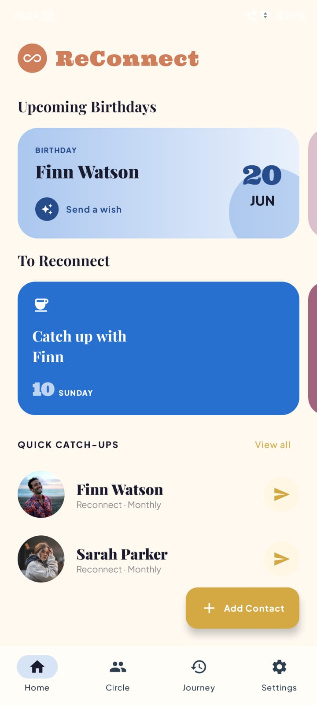
  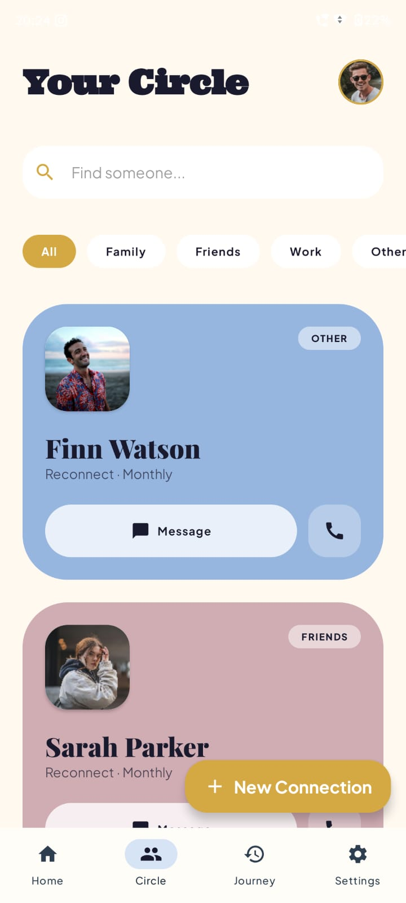
  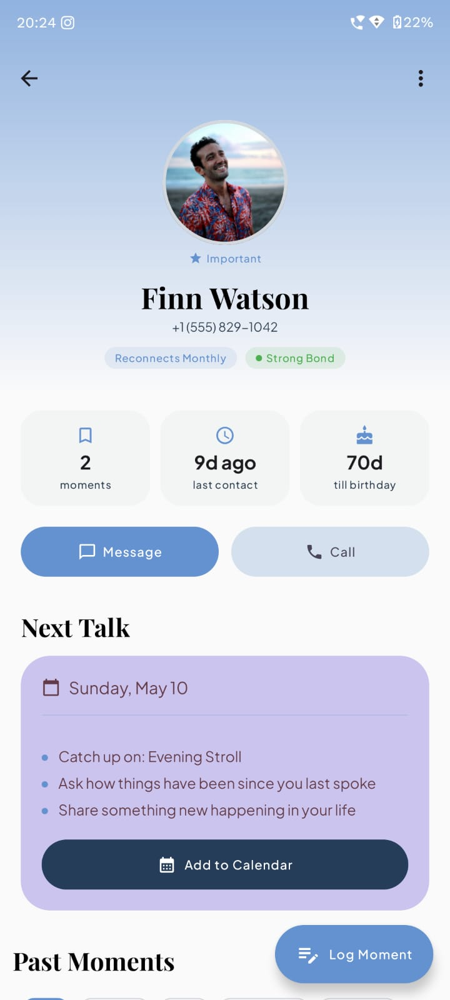
  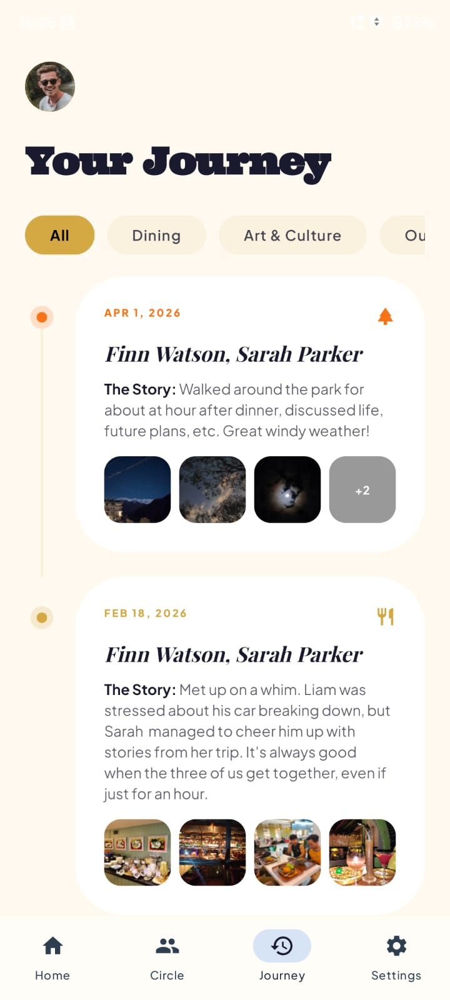
</p>

<p align="center">
  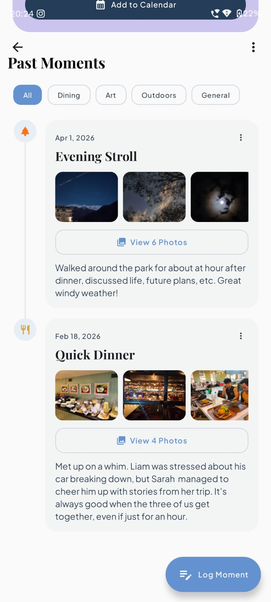
  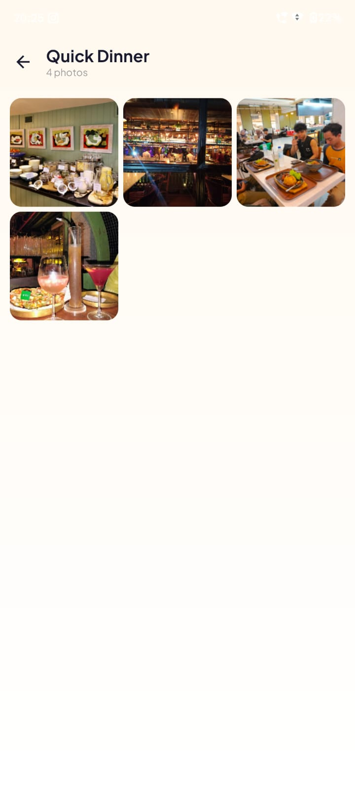
  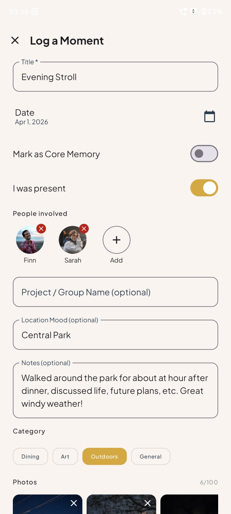
  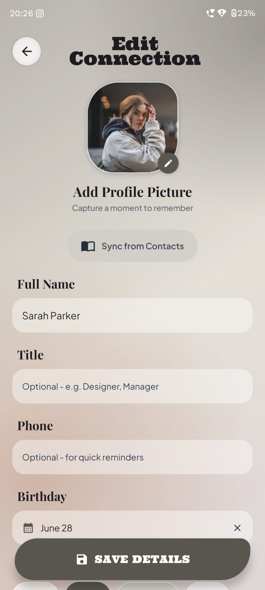
</p>

<p align="center">
  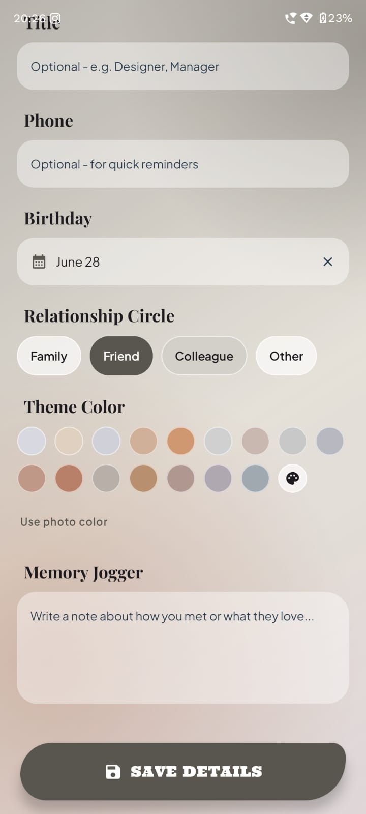
  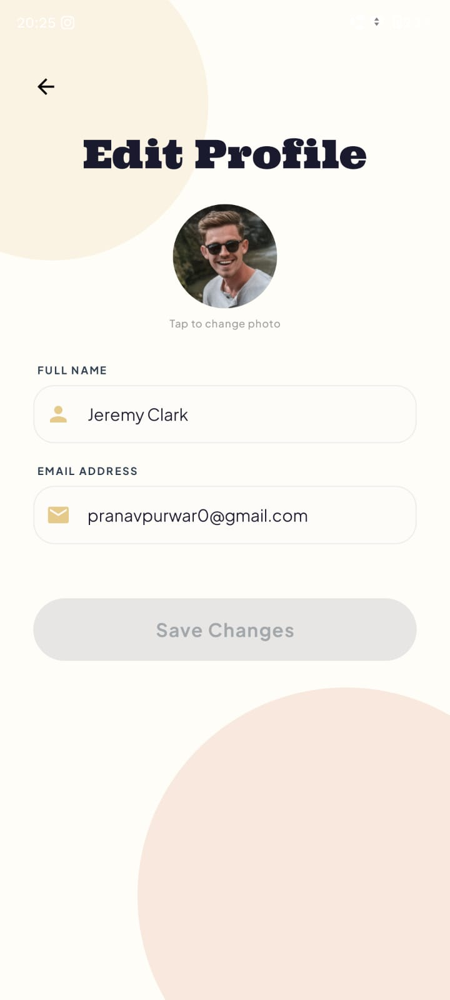
  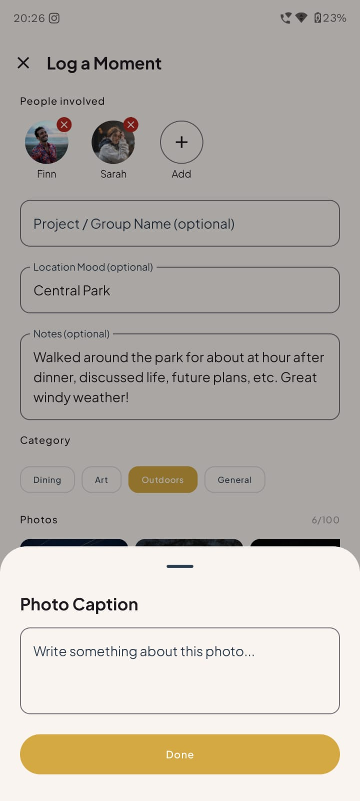
  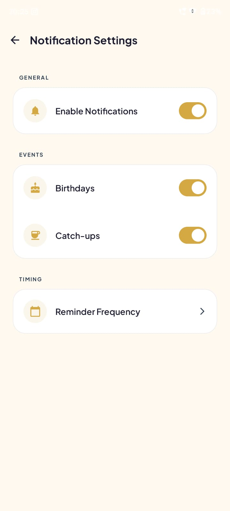
</p>

---


## What ReConnect is (and isn’t)

- Not a social media platform  
- Not a messaging app  
- Not a productivity CRM  

ReConnect helps you maintain real-world connections over time.

---

## What You Can Do

### 🤝 Staying in Touch
- Add people and define reconnect intervals  
- Get reminders if it’s been a while since you last interacted  

### 📸 Moments & Memories
- Create moments for meetups, trips, or hangouts  
- Attach photos to moments  
- Support for both one-on-one and group moments  

### 🕓 Timeline & Events
- View past interactions and shared moments over time  
- Track birthdays, anniversaries, and other important dates  

### ☁️ Sync & Variants
- Cloud sync via Supabase for backups and multi-device access  
- Local-only variant available for fully on-device usage  

---

## Example

You meet friends for dinner.

- Create a moment  
- Add everyone who was there  
- Attach photos  
- Set how often to stay in touch  

If time passes without interaction, ReConnect reminds you — so people don’t slowly fade out of your life.

---

## Getting Started

> The app is in early testing. Join the Discord server for bug reports and contributions.
> 
> https://discord.gg/46wCMRVAre

### Download  
https://github.com/PranavPurwar/ReConnect/actions

### First Launch
- Create your profile  
- Add people  
- Define reconnect intervals  

### Variants

| Variant   | Description |
|----------|------------|
| local     | Fully on-device, no sync |
| supabase  | Cloud sync, backups, multi-device |

---

## Cloud & AI

- Free sync with limited media storage  
- Paid tiers may include:
  - additional storage  
  - AI-based features (planned)  

This helps sustain server, database, and compute costs.

---

## Support

If you find ReConnect useful, consider supporting development:

> Open Collective supports cards, bank transfers, and more  

https://opencollective.com/invokevirtual

> UPI and crypto options are also available

https://pranavpurwar.github.io/donate.html

---

## License

ReConnect is licensed under the **GNU General Public License v3.0 (GPLv3)** with **Additional Terms under Section 7**.

### Mandatory Attribution

Any modified or redistributed version **must** include visible, user-facing attribution:

- "Based on the original open-source project ReConnect by Pranav Purwar."  
- Clearly visible in the app UI  
- Include a link to the original repository  

### Trademark & Branding

To protect users from malicious clones, the name **"ReConnect"** and the **official app icon** are
strictly protected trademarks of Pranav Purwar.

* You are **not** permitted to use the name "ReConnect" or the original icon for any derivative
  works, forks, or third-party distributions.
* Any redistribution or fork must use a distinctly different name, a different package ID (e.g.,
  changing `dev.pranav.reconnect` to something else), and a completely unique launcher icon.
* This is to easily distinguish the official app from any unauthorized copies, satisfying both
  open-source guidelines and protecting the project's identity.

```text
GNU General Public License v3.0 (with Section 7 Additional Terms)

Copyright (c) 2026 Pranav Purwar

This program is free software: you can redistribute it and/or modify
it under the terms of the GNU General Public License as published by
the Free Software Foundation, either version 3 of the License, or
(at your option) any later version.

Additional Term under Section 7(b):
You must retain prominent UI attribution, including the name of the original author (Pranav Purwar) 
and a link to the original repository, in any modified or redistributed versions of this software 
as described in the README's "Mandatory Prominent Attribution" section.

This program is distributed in the hope that it will be useful,
but WITHOUT ANY WARRANTY; without even the implied warranty of
MERCHANTABILITY or FITNESS FOR A PARTICULAR PURPOSE.  See the
GNU General Public License for more details.

You should have received a copy of the GNU General Public License
along with this program.  If not, see <https://www.gnu.org/licenses/>.
```

---

Stay in touch. That’s all it’s about.
